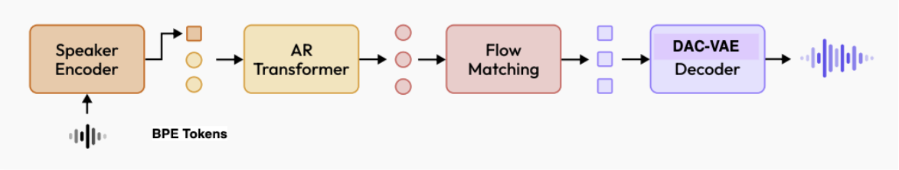

# MiniMax-Speech Technical Implementation

An unofficial implementation based on the MiniMax-Speech technical report, with core components adapted from [CosyVoice2](https://github.com/FunAudioLLM/CosyVoice).



## Overview

This repository provides an implementation of the MiniMax-Speech model, featuring a two-stage training approach for high-quality 24kHz audio generation.

## Key Features

- **24kHz Audio Support**: High-quality audio generation at 24kHz sampling rate
- **Two-Stage Architecture**: Optimized training pipeline with discrete and continuous representations
- **Modular Design**: Separate components for audio codec and variational autoencoder
- **CosyVoice2 Decoder**: Leverages proven components from the CosyVoice2's Decoder framework
- **Flow matching AE**: Flow matching training for autoencoders
- **Immiscible assignment**: Support immiscible adding noise while training

## Architecture

### Stage 1: Audio to Discrete Tokens
Converts raw audio into discrete representations using the FSQ (S3Tokenizer) framework.

### Stage 2: Discrete Tokens to Continuous Latent Space
Maps discrete tokens to a continuous latent space using a Variational Autoencoder (VAE).

> **Note**: This implementation uses standard DAC-VAE instead of Flow-VAE.

## Implementation Pipeline

### 1. Model Training

#### BPE tokens to FSQ tokens
- Based on the FSQ
- Using Auto Regressive to predict the FSQ tokens with learnable speaker extractor

#### FSQ tokens to DAC-VAE latent
- Based on Cosyvoice2 flow matching decoder
- Learns continuous latent representations from discrete tokens

### 2. Feature Extraction

Before training the main model:
1. Extract discrete tokens using the trained FSQ [S3Tokenizer](https://github.com/xingchensong/S3Tokenizer)
2. Generate continuous latent representations using the trained DAC-VAE - the pretrained I provided here: [DAC-VAE](https://drive.google.com/file/d/1iwZhPlcdDwvPjeON3bFAeYarsV4ZtI2E/view?usp=sharing)

### 3. Two-Stage Training

Train the models sequentially:
- **Stage 1**: BPE tokens → Discrete FSQ 
- **Stage 2**: Discrete FSQ → DAC-VAE Continuous latent space

## Getting Started

### Prerequisites
```bash
# List your dependencies here
pip install -r requirements.txt
```

### Training Pipeline

1. **Extracting FSQ** (if not using pretrained)
   ```bash
   # Add training command
   ```

2. **Extracting DAC-VAE latent**
   ```bash
   cd dac-vae
   python inference.py --checkpoint checkpoint.pt --config config.yml
   ```

3. **Stage 1: Auto Regressive Transformer**
   ```bash
   # Add feature extraction commands
   ```

4. **Stage 2: FLow matching decoder**
   ```bash
   # Add main training command
   ```

## Project Structure
```
minimax-speech/
├── assets/
│   └── image.png
├── configs/
│   └── dac_vae.yaml
├── models/
│   ├── fsq/
│   └── dac_vae/
├── cosyvoice/          # Components from CosyVoice2
│   ├── flow/
│   ├── transformer/
│   └── utils/
└── README.md
```

## Related Projects

This implementation builds upon several key projects:

- **[CosyVoice2](https://github.com/FunAudioLLM/CosyVoice)**: Core model architectures and training pipelines
- **[Descript Audio Codec](https://github.com/descriptinc/descript-audio-codec)**: Audio tokenization framework
- **MiniMax-Speech**: Original technical report and methodology

## Citation

If you use this code in your research, please cite:

```bibtex
@article{minimax-speech,
  title={MiniMax-Speech},
  author={[MiniMax team]},
  year={[2025]}
  url={https://arxiv.org/pdf/2505.07916}
}

@misc{cosyvoice2,
  title={CosyVoice: A Scalable Multilingual Zero-shot Text-to-speech Synthesizer based on Supervised Semantic Tokens},
  author={[FunAudioLLM Team, SpeechLab@Tongyi, Alibaba Group]},
  year={2024},
  url={https://github.com/FunAudioLLM/CosyVoice}
}
```

## License

This project follows the licensing terms of its dependencies:
- CosyVoice2 components: [Check CosyVoice2 License](https://github.com/FunAudioLLM/CosyVoice/blob/main/LICENSE)
- FSQ components: [Apache 2.0 License](https://github.com/xingchensong/S3Tokenizer/blob/main/LICENSE)
- Original contributions: [Specify your license here]

## Acknowledgments

- **[CosyVoice2](https://github.com/FunAudioLLM/CosyVoice)**: This implementation extensively uses code and architectures from CosyVoice2
- **[FSQ](https://github.com/xingchensong/S3Tokenizer)**: For the FSQ implementation
- **MiniMax team**: For the technical report and methodology
- **FunAudioLLM team**: For the excellent CosyVoice2 codebase

## Contributing

Contributions are welcome! Please feel free to submit a Pull Request.

## Disclaimer
The content provided above is for academic purposes only and is intended to demonstrate technical capabilities.

## Contact

[nguyennhutsam.math@gmail.com, https://www.linkedin.com/in/primepake/]